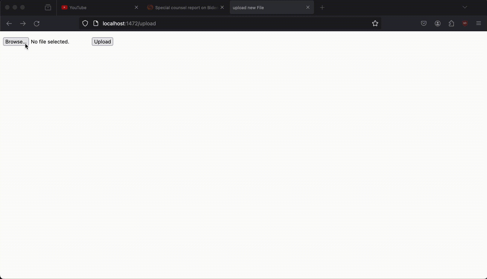

# Flask on Docker project
## Overview
This is a project which utilizes Flask, Docker, Gunicorn, and Nginx to create an docker 'app' which allows for the uploading and viewing of static image files. The 'app' uses Postgres to handle the databases. This repo was made using the following [tutorial](https://testdriven.io/blog/dockerizing-flask-with-postgres-gunicorn-and-nginx/). This project was done to develop my skills in understanding how docker containers work and the use of docker with databases. Below is a gif showing off what uploading a image to the 'app' and viewing the image looks like. 

## Run Instructions

### Setup
Clone this repo, and enter the root of the project.
```
$git clone https://github.com/irajmoradi/flask-on-docker.git
$cd flask-on-docker
```

### Production
To run the production version of the container make sure to create a .env.prod.db file with the username, password, and database name, and put it into the root folder. 
Run the commands
```
$ docker-compose -f docker-compose.prod.yml up -d --build
$ docker-compose -f docker-compose.prod.yml exec web python manage.py create_db
```
And then you can upload files on [http://localhost:1472/upload](http://localhost:1472/upload) and view them on [http://localhost:1472/media/File_Name](http://localhost:1472/media/File_Name).
### Development
Run 
```
docker-compose up -d --build
```
And then you can upload files on [http://localhost:1472/upload](http://localhost:1472/upload) and view them on [http://localhost:1472/media/File_Name](http://localhost:1472/media/File_Name).

